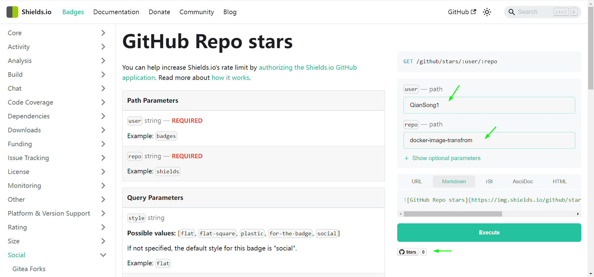
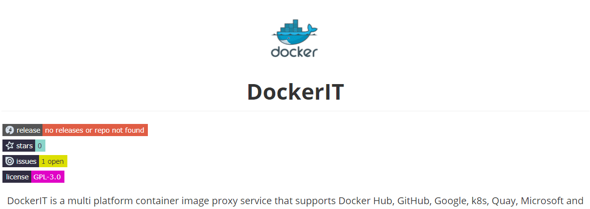
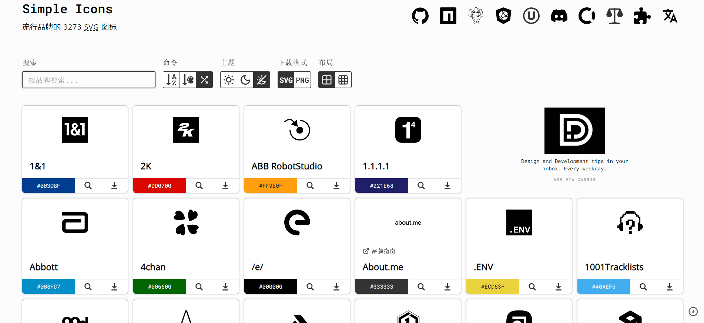
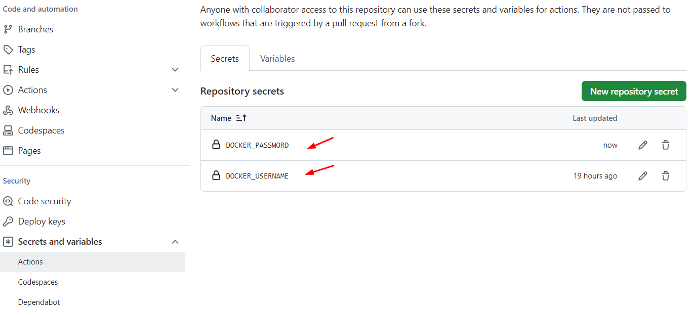
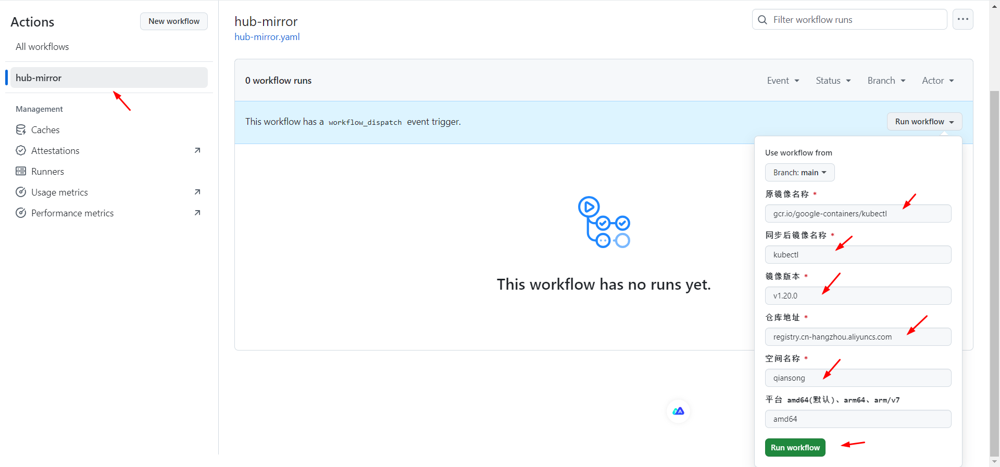
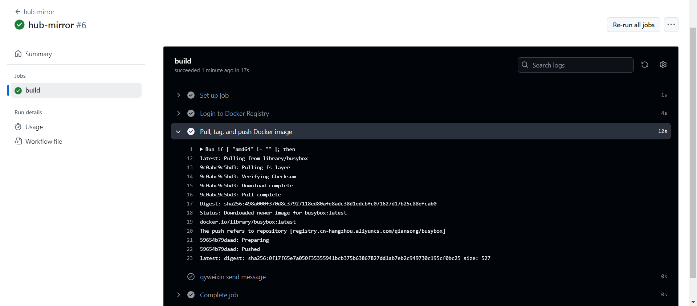
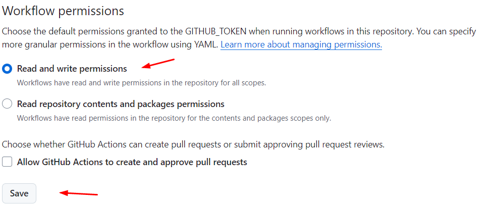
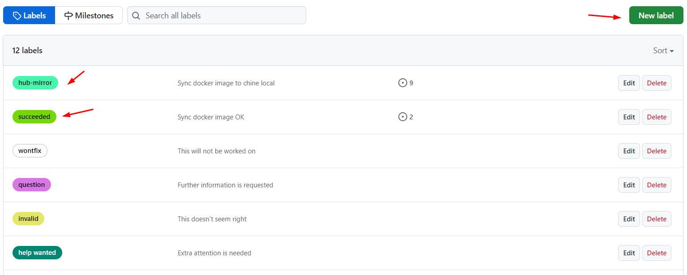
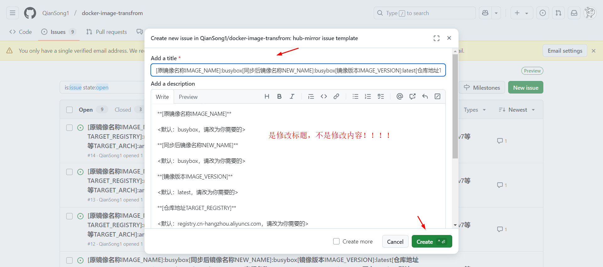

<div align="center" id="madewithlua">
  
</div>

<h1 align="center">DockerIT</h1>

[](https://github.com/QianSong1/docker-image-transfrom/releases)
[](https://github.com/QianSong1/docker-image-transfrom/stargazers)
[](https://github.com/QianSong1/docker-image-transfrom/issues)
[](https://github.com/QianSong1/docker-image-transfrom/blob/main/LICENSE)

<p align="center">
DockerIT is a multi platform container image proxy service that supports Docker Hub, GitHub, Google, k8s, Quay, Microsoft and other image repositories.
</p>

# docker-image-transfrom

docker-image-transfrom 自动转换docker、k8s、quay.io等等国外镜像到国内仓库


# readme添加徽章

网站：https://shields.io/badges/git-hub-repo-stars

填写用户名称、仓库名称、图标、颜色等等信息点击执行生成代码

 

将其复制粘贴到`README.md`文档中，就像这样

```markdown
<div align="center" id="madewithlua">
  
</div>
<h1 align="center">DockerIT</h1>


<p align="center">
DockerIT is a multi platform container image proxy service that supports Docker Hub, GitHub, Google, k8s, Quay, Microsoft and other image repositories.
</p>
```

之后就会显示这样的漂亮效果

 

图标搜索网站：https://simpleicons.org/

 


# docker镜像转换

## 1.手动使用流程

### 1️⃣ Fork 本项目

`Fork` 该项目，后续所有操作都在你 `Fork` 的仓库中进行。


### 2️⃣ 绑定账号

- 进入项目 `Settings` → `Secrets and variables` → `Actions`
- 选择 `New repository secret`，并添加以下 `Secrets`：

  - `DOCKER_USERNAME`：镜像仓库登录名
  - `DOCKER_PASSWORD`：镜像仓库密码
  - `QYWX_ROBOT_URL`：(可选）企业微信群机器人 URL。如果你想要接收自动化操作的通知，可以填写该密钥，否则可不填写。

🔹 **示例截图**  

  


### 3️⃣ 运行Action

- 进入项目 `Actions` 
- 找到 `hub-mirror`工作流
- 按照要求填写参数，点击运行该工作流

🔹 **示例截图**  

  


### 4️⃣ 查看结果

- 当 hub-mirror 执行完毕后，你将在你的目标 Docker 仓库中看到推送过来的镜像。

🔹 **示例截图**  

 


### 5️⃣ 微信说明

- 如果填写了企业微信群机器人 URL，你将会收到操作的通知。


### 6️⃣ 注意事项

- 请确保你的 Docker 用户名和密码是正确的，以便 docker-mirror 可以顺利地拉取和推送镜像。

- 如果使用企业微信群机器人接收通知，请确保机器人 URL 是正确的，并且你有权限接收该群的通知。


## 2.创建issue触发使用流程

### 1️⃣ Fork 本项目

`Fork` 该项目，后续所有操作都在你 `Fork` 的仓库中进行。


### 2️⃣ 绑定账号

- 进入项目 `Settings` → `Secrets and variables` → `Actions`
- 选择 `New repository secret`，并添加以下 `Secrets`：

  - `DOCKER_USERNAME`：镜像仓库登录名
  - `DOCKER_PASSWORD`：镜像仓库密码
  - `QYWX_ROBOT_URL`：(可选）企业微信群机器人 URL。如果你想要接收自动化操作的通知，可以填写该密钥，否则可不填写。

🔹 **示例截图**  

  


### 3️⃣ 设置Action权限

- 进入项目 `Settings`→`Actions` →`General`→`Workflow permissions`
- 找到 `[√] Read and write permissions`
- 把它勾选上

🔹 **示例截图**  

  


### 4️⃣ 添加标签

- 进入项目`Issues`→`Labels`

- 依次创建以下标签
  - `hub-mirror`
  - `succeeded`
  - `failure`

🔹 **示例截图**  

  


### 5️⃣ 创建issue触发同步

- 按照模板修改issue标题，所有参数都是从标题里边获取的
- 确保标题里边参数正确，不然会同步失败

🔹 **示例截图**  

 


### 6️⃣ 注意事项

- 请确保你的 Docker 用户名和密码是正确的，以便 docker-mirror 可以顺利地拉取和推送镜像。

- 如果使用企业微信群机器人接收通知，请确保机器人 URL 是正确的，并且你有权限接收该群的通知。

